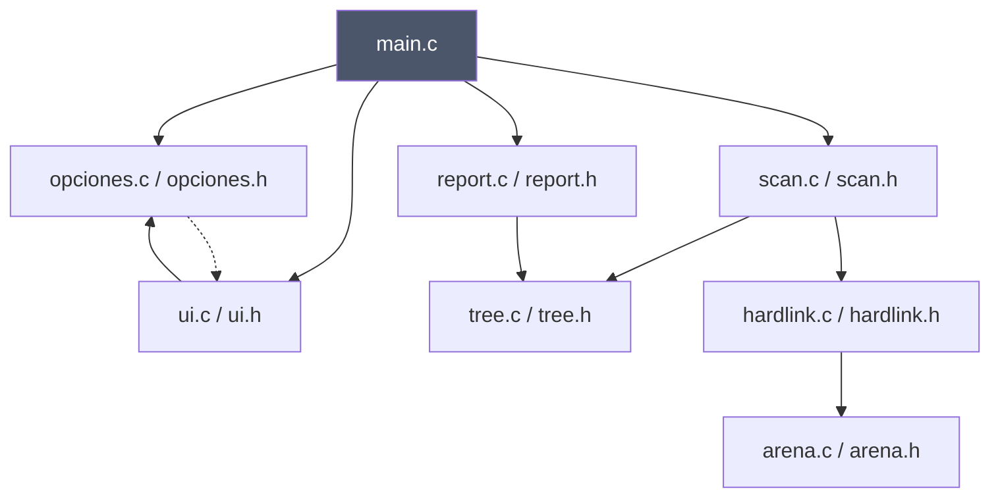
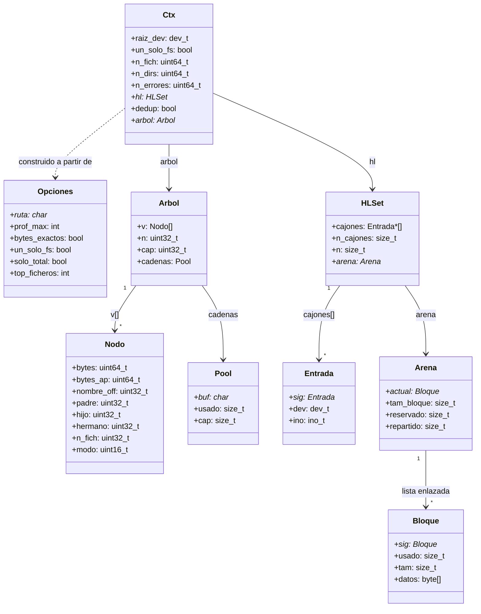
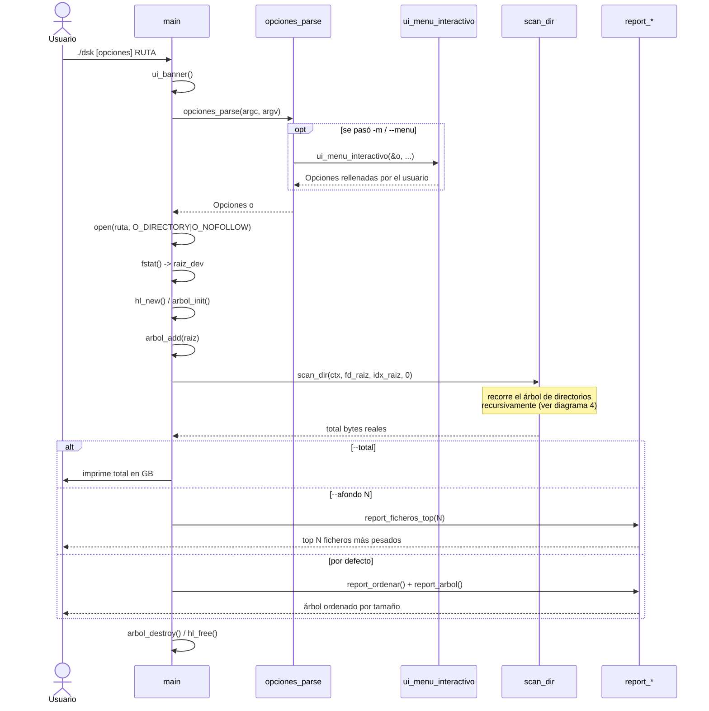
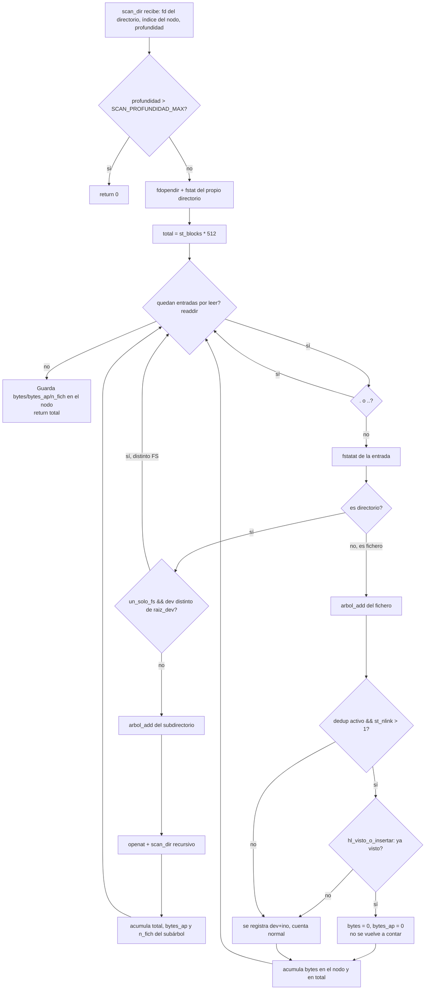
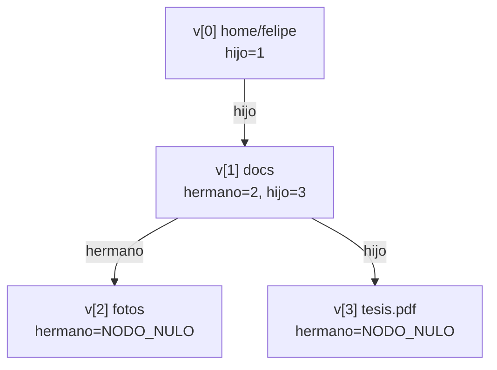

# Arquitectura de DiskScan

Documentación técnica del funcionamiento interno. Pensada para quien vaya a leer o modificar
el código fuente en [`src/`](../src).

## 1. Módulos y dependencias

Quién incluye a quién (`#include` propios, no del sistema):

`opciones.c` llama a `ui_menu_interactivo()` cuando se pasa `-m/--menu` (línea punteada), y a
la vez `ui.h` incluye `opciones.h` porque necesita el tipo `Opciones`. No es un ciclo real —
solo las cabeceras (`.h`) definen las dependencias de compilación, y ninguna se incluye a sí
misma indirectamente — pero es la zona más acoplada del código y la primera candidata a romper
si se refactoriza.

`arena.c` es la única pieza sin dependencias propias: es el módulo base sobre el que se apoya
`hardlink.c`.

## 2. Estructuras de datos principales

Puntos clave de este diseño:

- **`Arbol` no usa punteros entre nodos**, usa índices `uint32_t` dentro de `v[]` (`padre`,
  `hijo`, `hermano`). Es una lista enlazada de hijos, no un array de hijos por nodo — cada nodo
  solo conoce a su primer hijo y a su siguiente hermano.
- **`Pool` guarda todos los nombres de fichero concatenados** en un único buffer; cada `Nodo`
  solo guarda el offset (`nombre_off`) dentro de ese buffer. Evita un `malloc` por nombre.
- **`HLSet` (deduplicación de hardlinks)** es un hashset de `(dev, ino)` con listas de
  colisión, cuyas entradas (`Entrada`) viven en un `Arena` en vez de mallocs sueltos.
- **`Arena`** reserva memoria en bloques grandes (`Bloque`) y reparte trozos alineados dentro
  de cada bloque; solo libera todo de golpe al final (`arena_free`), nunca entrada por entrada.

## 3. Flujo principal (`main`)

## 4. Algoritmo de escaneo (`scan_dir`)

Las dos decisiones que definen el comportamiento de DiskScan frente a `du` están ahí: el corte
por punto de montaje (`un_solo_fs`) y la deduplicación de hardlinks (`dedup` + `HLSet`), ambas
resueltas por fichero/directorio durante el mismo recorrido, sin una segunda pasada.

## 5. Ejemplo de árbol por índices

Para visualizar cómo queda `Arbol.v[]` tras escanear `/home/felipe` con dos subcarpetas:

No hay array de hijos por nodo: `docs` solo apunta a su primer hijo (`tesis.pdf`) y a su
siguiente hermano (`fotos`); recorrer todos los hijos de un nodo es seguir la cadena de
`hermano` a partir de `hijo`.
